<!-- HEADER SECTION -->
<h5 align="center" style="padding:0;margin:0;">Hannah Naidoo</h5>
<h5 align="center" style="padding:0;margin:0;">21100366</h5>
<h6 align="center">Interactive Development 300</h6>
<p align="center">

  <h3 align="center">SynK</h3>

  <p align="center">
    DJ Remix Competition <br>
      <a href="https://github.com/HannahAmaria/DV300Term2/issues"><strong>Explore the docs »</strong></a>
   <br />
   <br />
   <a href="https://drive.google.com/file/d/1jQEfhWcnwQMBhT9PAWrn_JWwpCxSVKzn/view?usp=sharing">View Demo</a>
    ·
    <a href="https://github.com/HannahAmaria/DV300Term2/issues">Report Bug</a>
    ·
    <a href="https://github.com/HannahAmaria/DV300Term2/issues">Request Feature</a>
</p>
<!-- TABLE OF CONTENTS -->
## Table of Contents

* [About the Project](#about-the-project)
  * [Project Description](#project-description)
  * [Built With](#built-with)
* [Getting Started](#getting-started)
  * [Prerequisites](#prerequisites)
  * [How to install](#how-to-install)
* [Features and Functionality](#features-and-functionality)
* [Concept Process](#concept-process)
   * [Ideation](#ideation)
   * [Wireframes](#wireframes)
   * [User-flow](#user-flow)
* [Development Process](#development-process)
   * [Implementation Process](#implementation-process)
        * [Highlights](#highlights)
        * [Challenges](#challenges)
   * [Future Implementation](#peer-reviews)
* [Final Outcome](#final-outcome)
    * [Mockups](#mockups)
    * [Video Demonstration](#video-demonstration)
* [Conclusion](#conclusion)
* [Contributing](#contributing)
* [License](#license)
* [Contact](#contact)
* [Acknowledgements](#acknowledgements)

<!--PROJECT DESCRIPTION-->
## About the Project
<!-- header image of project -->
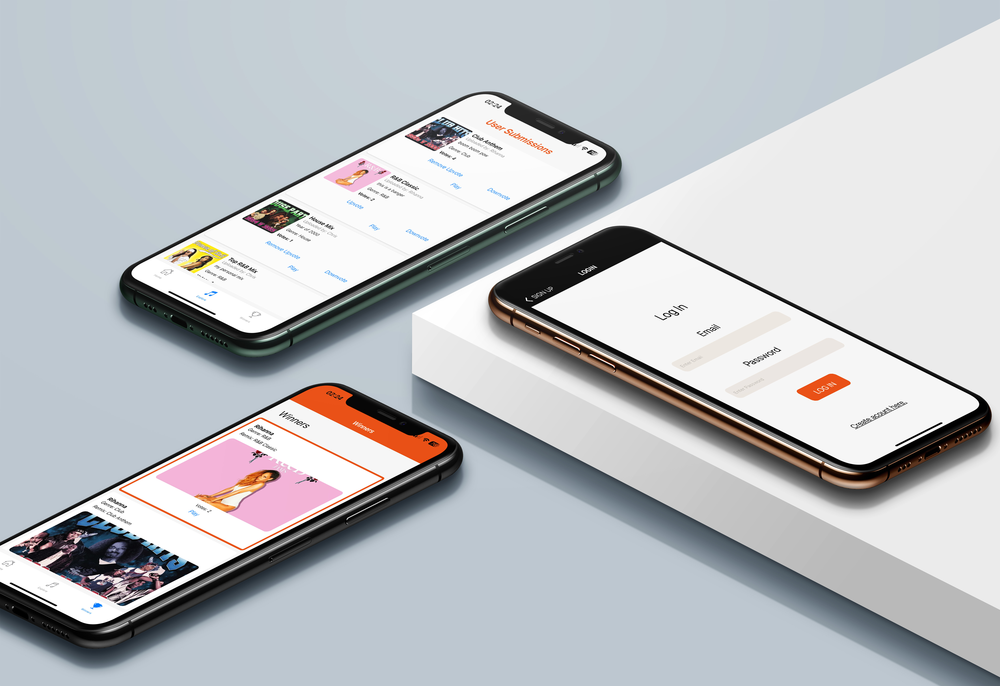

### Project Description

Created a cross-platform mobile application using React Native and Google Firebase. The app allows multiple users to sign in and enter a remix competition. Users can enter a competition see their progress and vote.

### Built With

* [React Native](https://reactnative.dev/)
* [Google Firebase](https://firebase.google.com/)
* [Expo Go](https://expo.dev/go)

<!-- GETTING STARTED -->
<!-- Make sure to add appropriate information about what prerequisite technologies the user would need and also the steps to install your project on their own machines -->
## Getting Started

The following instructions will get you a copy of the project up and running on your local machine for development and testing purposes.

### Prerequisites

Ensure that you have the latest version of [React Native](https://reactnative.dev/) installed on your machine. 

### How to install

### Installation
Here are a couple of ways to clone this repo:

1. Software </br>
`GitHub Desktop` -> `File` -> `Clone repository` -> `URL`</br>
Enter `https://github.com/HannahAmaria/DV300Term2.git` into the URL field and press the `Clone` button.

2. Clone Repository </br>
Run the following in the command-line to clone the project:
   ```sh
   git clone https://github.com/HannahAmaria/DV300Term2.git
   ```
    Open `GitHub Desktop` and select `File | Open...` from the menu. Select cloned directory and press `Open in Visual Studio Code` button

3. Navigate to Project Directory </br>
Change directory to the project folder:
   ```sh
   cd synk
   ```

4. Install Dependencies </br>
Run the following command to install necessary dependencies:
   ```sh
   npm install
   ```

5. Start Expo </br>
Launch Expo by running:
   ```sh
   npm start
   ```


<!-- FEATURES AND FUNCTIONALITY-->
<!-- You can add the links to all of your imagery at the bottom of the file as references -->
## Features and Functionality

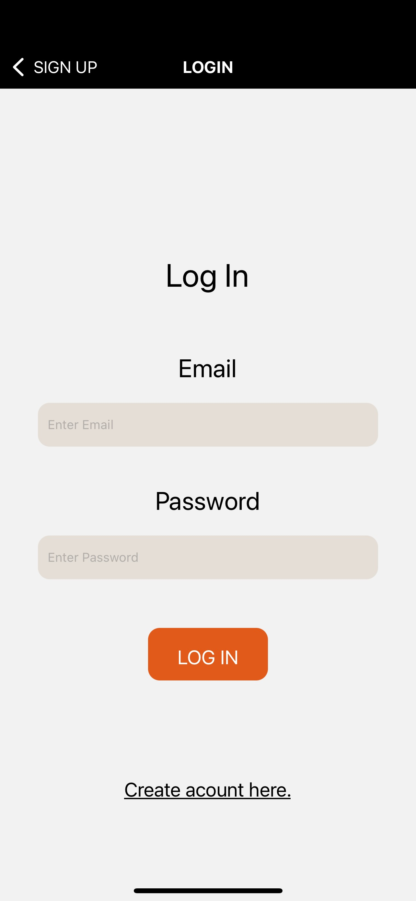
### Authentication

User is able to create an account/profile so that they can log on to and out of the app as a normal user or judge.

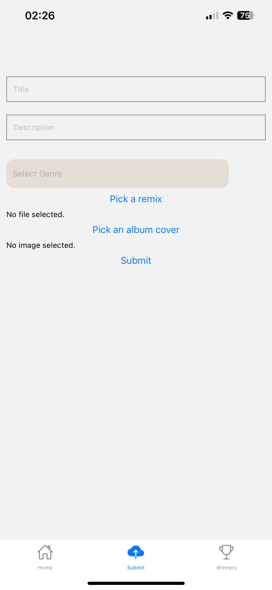
### Competition

User is able to view, enter and compete in the competition. 

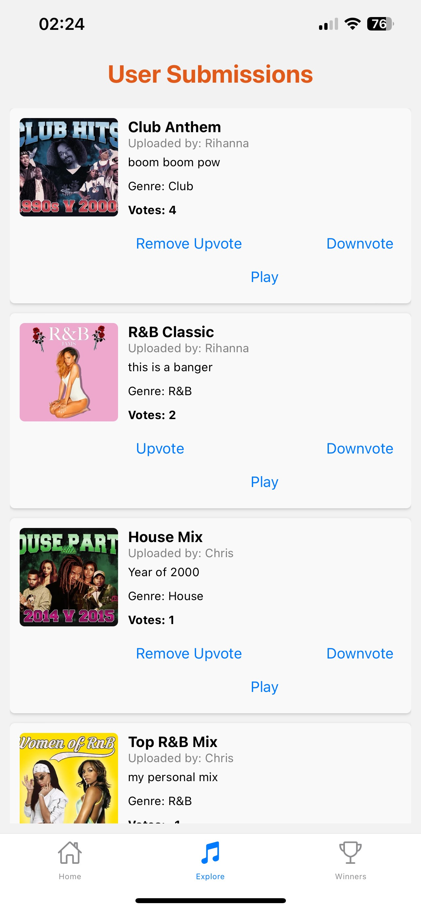
### Voting

User is able to log on and add the results to each entry.

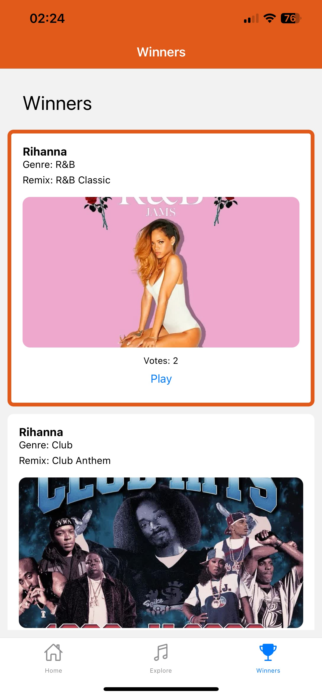
### Result

The user should be able to view the results of the competition.

<!-- CONCEPT PROCESS -->
<!-- Briefly explain your concept ideation process -->
## Concept Process

The `Conceptual Process` is the set of actions, activities and research that was done when starting this project.

### Ideation


### Wireframes

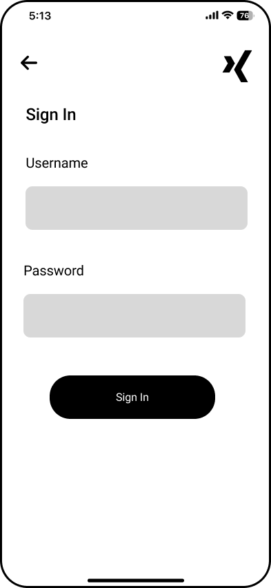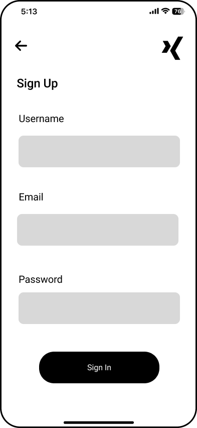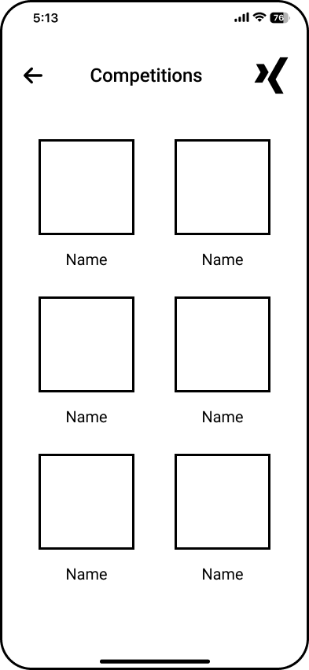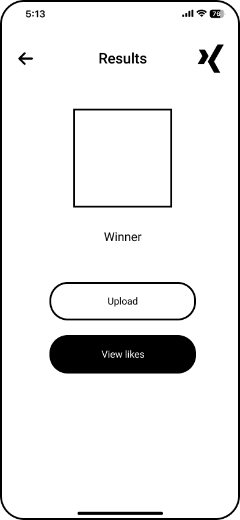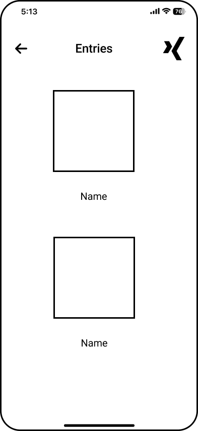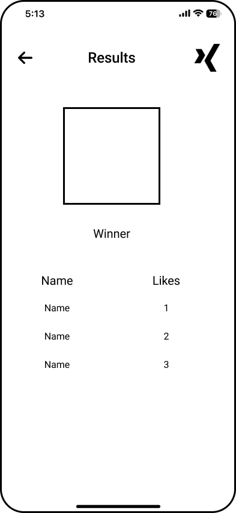

<!-- DEVELOPMENT PROCESS -->
## Development Process

The `Development Process` is the technical implementations and functionality done in the frontend and backend of the application.

### Implementation Process
<!-- stipulate all of the functionality you included in the project -->

* Made use of both `React Native` and `Google Firebase` to create a cross-platform mobile remix competition application. 
* Made use of `YouTube` to create audio files and remix covers. 

#### Highlights
<!-- stipulated the highlight you experienced with the project -->
* Achieved 95% project completion.
* Implemented a simple and straightforward design.

#### Challenges
<!-- stipulated the challenges you faced with the project and why you think you faced it or how you think you'll solve it (if not solved) -->
* Difficulty integrating audio files.

### Future Implementation
<!-- stipulate functionality and improvements that can be implemented in the future. -->

* Enhance the design.

<!-- MOCKUPS -->
## Final Outcome

### Mockups

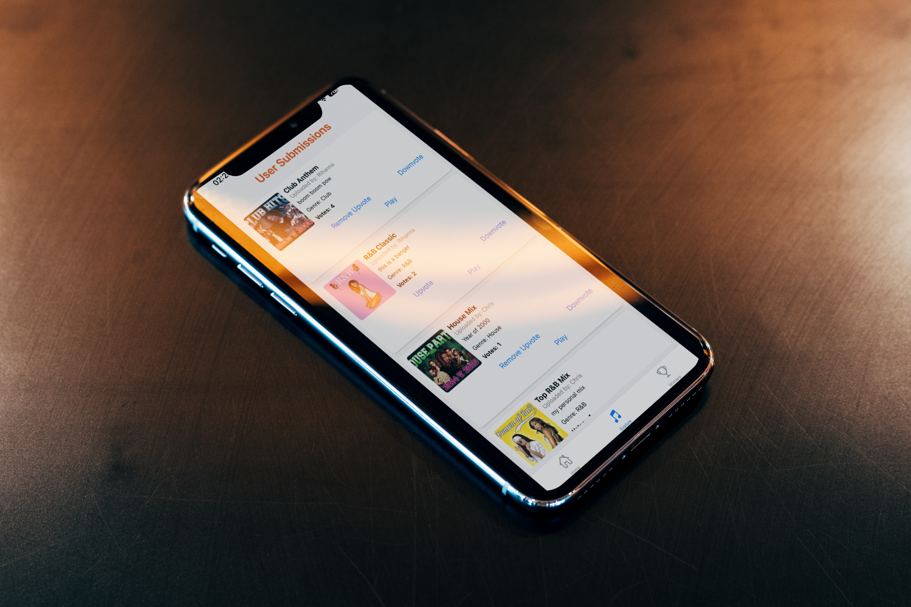
<br>
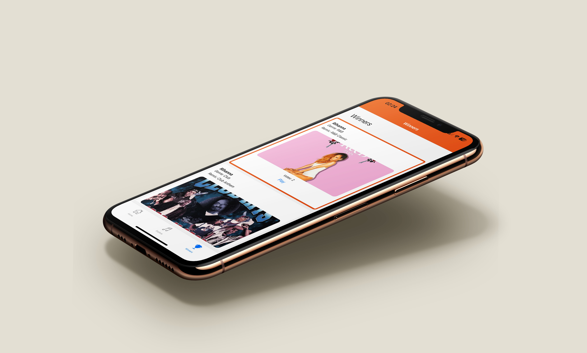

<!-- VIDEO DEMONSTRATION -->
### Video Demonstration

To see a run through of the application, click below:

[View Demonstration](https://drive.google.com/file/d/1hrXlPQm_waY5H67_-hV0N54cOaK6-GcC/view?usp=sharing)

<!-- CONTRIBUTING -->
## Contributing

Contributions are what makes the open-source community such an amazing place to learn, inspire, and create. Any contributions you make are **greatly appreciated**.

1. Fork the Project
2. Create your Feature Branch (`git checkout -b feature/SynK`)
3. Commit your Changes (`git commit -m 'Add some SynK'`)
4. Push to the Branch (`git push origin feature/SynK`)
5. Open a Pull Request

<!-- AUTHORS -->
## Authors

* **Hannah Naidoo** - [HannahAmaria](https://github.com/HannahAmaria)

<!-- LICENSE -->
## License

Distributed under the MIT License. See `LICENSE` for more information.\

<!-- LICENSE -->
## Contact

* **Hannah Naidoo** - [21100366@virtualwindow.co.za](21100366@virtualwindow.co.za)
* **Project Link** - https://github.com/HannahAmaria/DV300Term2

<!-- ACKNOWLEDGEMENTS -->
## Acknowledgements
<!-- all resources that you used and Acknowledgements here -->
* [React Native](https://reactnative.dev/)
* [ChatGPT](https://chatgpt.com/)
* [DJ Discretion](https://www.youtube.com/channel/UCYck6zY3HFdXbfYAttthKzw)

<!-- MARKDOWN LINKS & IMAGES -->
[image1]: /path/to/image.png
[image2]: /path/to/image.png
[image3]: /path/to/image.png
[image4]: /path/to/image.png
[image5]: /path/to/image.png
[image6]: /path/to/image.png
[image7]: /path/to/image.png
[image8]: /path/to/image.png
[image9]: /path/to/image.png
[image10]: /path/to/image.png


<!-- Refer to https://shields.io/ for more information and options about the shield links at the top of the ReadMe file -->
[linkedin-shield]: https://img.shields.io/badge/-LinkedIn-black.svg?style=flat-square&logo=linkedin&colorB=555
[linkedin-url]: https://www.linkedin.com/in/nameonlinkedin/
[instagram-shield]: https://img.shields.io/badge/-Instagram-black.svg?style=flat-square&logo=instagram&colorB=555
[instagram-url]: https://www.instagram.com/instagram_handle/
[behance-shield]: https://img.shields.io/badge/-Behance-black.svg?style=flat-square&logo=behance&colorB=555
[behance-url]: https://www.behance.net/name-on-behance/
